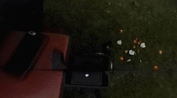
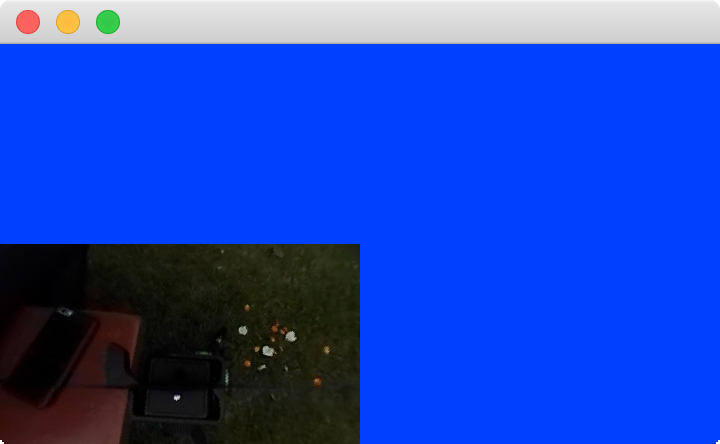
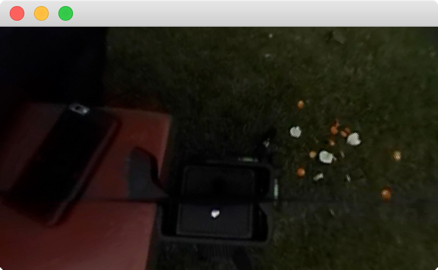

# 360 VR Equirectangular Projector



## Requirements
- OpenGL 3
- GLFW 3
- OpenCV 3.X+

## Options


- Projection mode

```
SphericalPlayer.cpp

#define PROJ_MODE 1
// Positive projection : 1
// Negative projection : 0
```

- Configure paths

```
run.py

IMGPATH_F = "image_paths.txt"
SUBSHOTPATH = "../subshots/"
PROJPATH = "../81patches"
```

## How to
1. Set options
2. run by `python run.py'

3. Move the window with the blue background using the mouse. It will become normal.




4. Press SpaceKey and wait
5. See results 

## etc
1. I failed to link C++ Boost library... Please use Python
2. For equirectangular video projection code, [jysung710@mgmail.com](mailto:jysung710@gmail.com)